# learn-modern-opengl

Projeto criado para aprender opengl - exemplos com refatorações do site [learn opengl](https://learnopengl.com/)

## 📋 Instalações das dependências (Linux)

### Instalação da lib X11

```
sudo apt-get install doxygen dnf xorg-dev
sudo dnf install libXcursor-devel libXi-devel libXinerama-devel libXrandr-devel
```

### Instalação da lib GLFW (GLFW-3.3.8)

Baixar o pacote [GLFW-3.3.8](https://www.glfw.org/download)

Após baixar, extrair e faça a compilação usando os comandos dentro da pasta ```glfw-3.3.8```

```
cmake -S . -B build
cmake build
cd build
make build
sudo make install
```

Ao finalizar, será exibido no terminal, os locais de instalações das libs e os includes como pode ser visto na imagem abaixo:


### Instalação do Assimp (Assimp-5.3.1)

Baixe o Assimp [assimp-5.3.1](https://github.com/assimp/assimp)
após baixar, extrair e faça a sua build

```
cd assimp
cmake CMakeLists.txt 
cmake --build .
```

após fazer a build, copie os arquivos ```.so``` para a pasta ```/usr/local/lib``` e crie um atalho do ```libassimp.so.5``` para a 
pasta principal do projeto clonado

### Instalação do FreeType 2 (freetype-2.13.2)

Baixe o freetype [freetype-2.13.2](https://freetype.org/)

Após baixar, extrai e faça a build

```
cd freetype-2.13.2
./configure --enable-static
make
```

O arquivo ```.a```  deverá estar em uma pasta oculta chamada ```.lib``` dentro de objs

PS: O projeto já consta com a lib compilada e configurada para linux (Ubuntu 24.04 - 6.2.0-37-generic)

## 🔧 Configuração do CodeBlock

Verifique se a configuração do seu codeblock como segue as imagens a seguir:


Pronto, o Codeblock está configurado

### 🚀 Executando um exemplo

Após finalizar a instalação das libs e a configuração do codeblock, no arquivo ```tests.hpp``` mude os exemplos pela definition ```#define run(width, height) run_XXX(width, height)``` , onde o ```XXX``` é o número do exemplo que você deseja.

## Exemplo-1 (Draw Quad)


## Exemplo-2 (Draw Quad)


## Exemplo-3 (Draw Quad)


## Exemplo-4 (Draw Cube)


## Exemplo-5 (Light Shader)


## Exemplo-6 (Material Shader)


## Exemplo-7 (Material Shader)


## Exemplo-8 (Emit Shader)


## Exemplo-9 (Light Shader)


## Exemplo-10 (Light Shader)


## Exemplo-12 (Loading Model)


## Exemplo-14 (Outline Shader)


## Exemplo-15 (Transparent Shader)


## Exemplo-16 (Kernel Shader)


## Exemplo-17 (Kernel Shader)


## Exemplo-18 (Skybox Mapping)
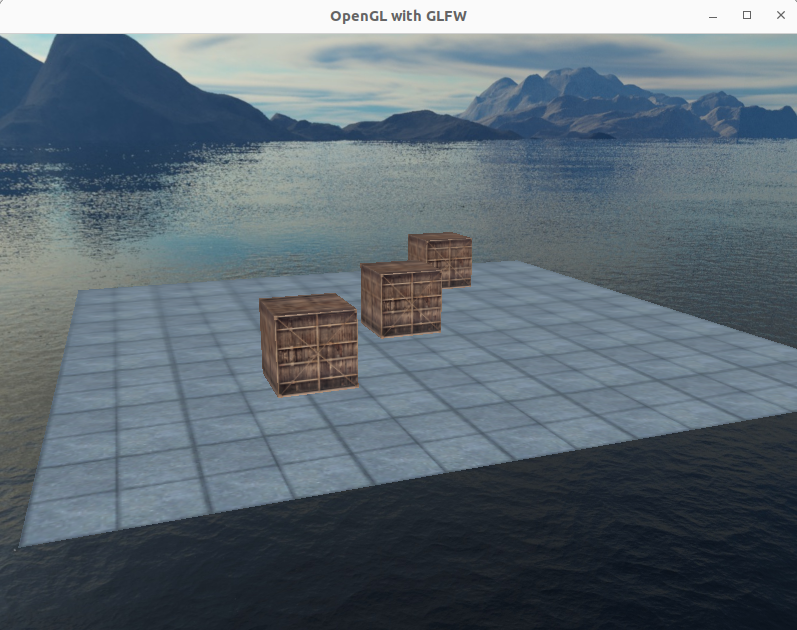

## Exemplo-22 (Geometry Shader)
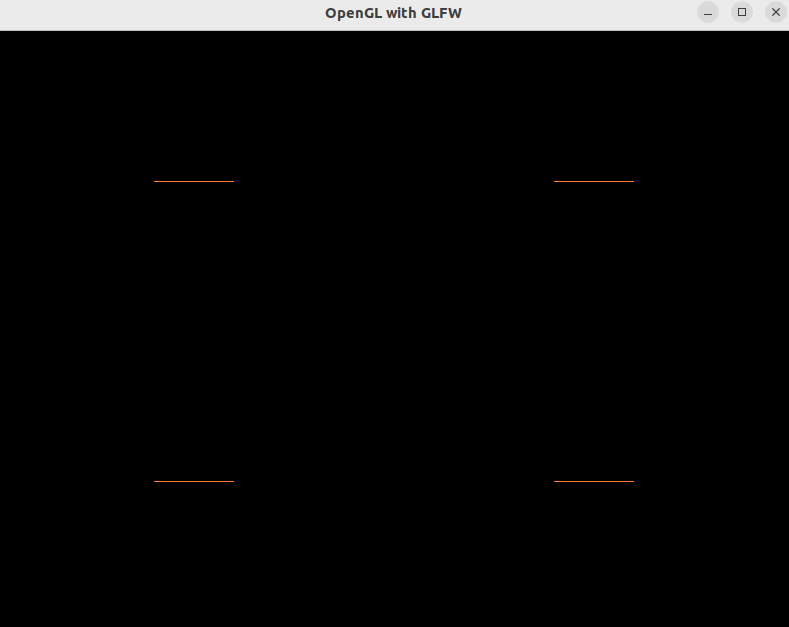

## Exemplo-23 (Geometry Shader)
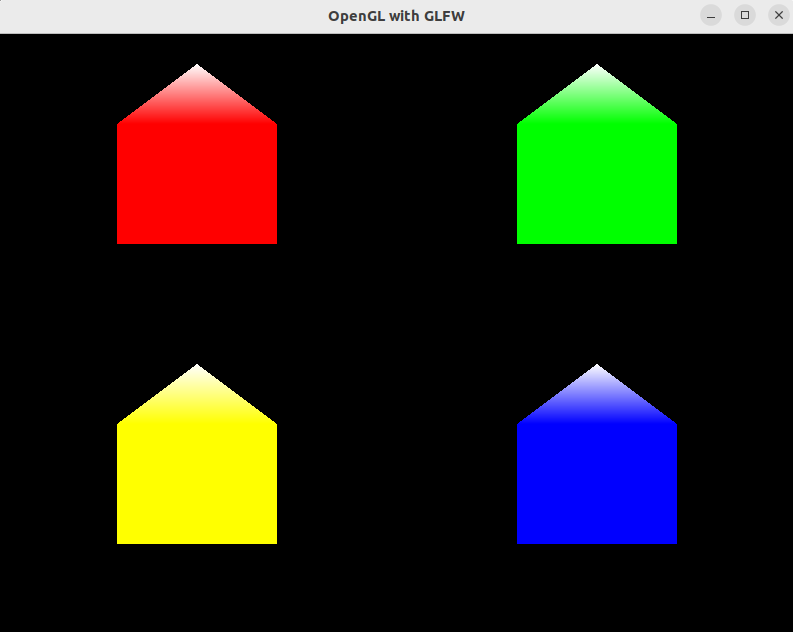

## Exemplo-24 (Exploded Shader)


## Exemplo-25 (Normal Vertex Shader)
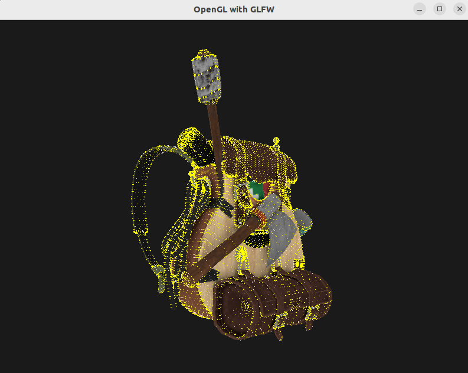

## Exemplo-26 (Instances)
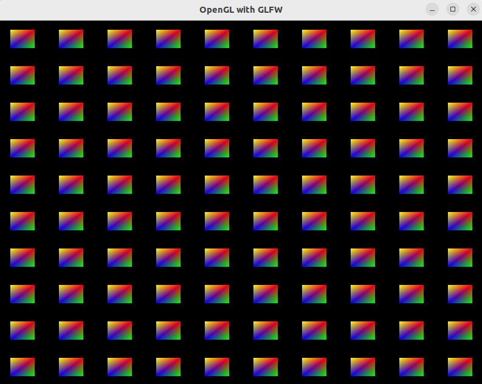

## Exemplo-27 (Instances)
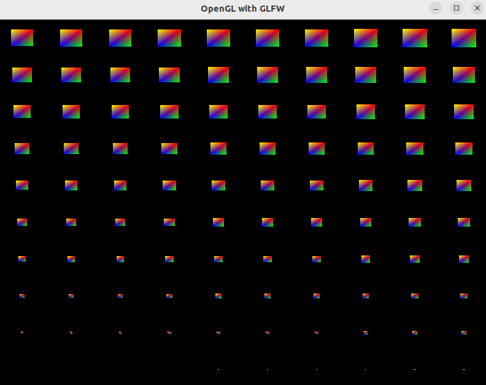

## Exemplo-28 (Instances)
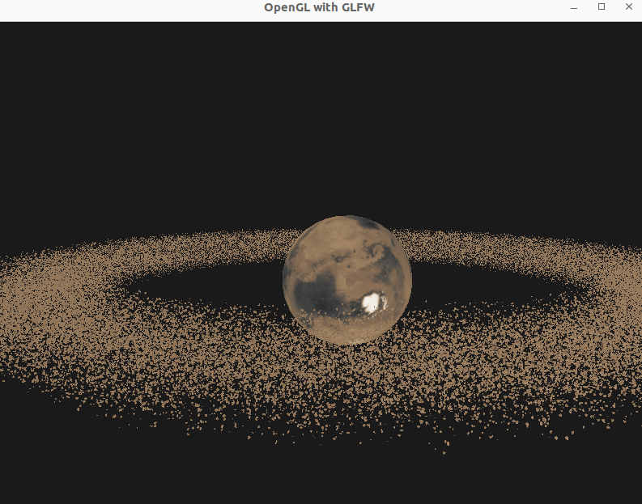

## Exemplo-29 (MSAA)
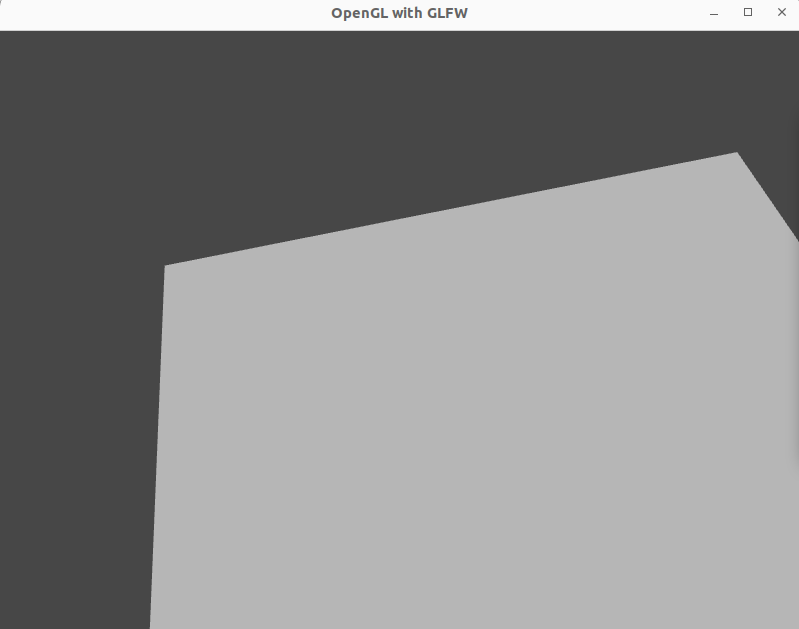

## Exemplo-30 (Blinn-Phong)
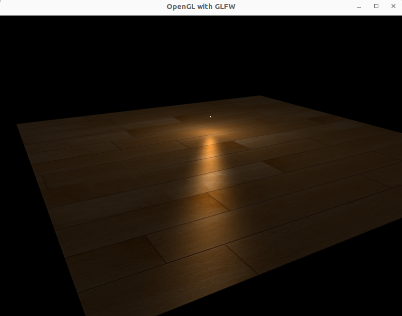

## Exemplo-31 (Gamma Correction)
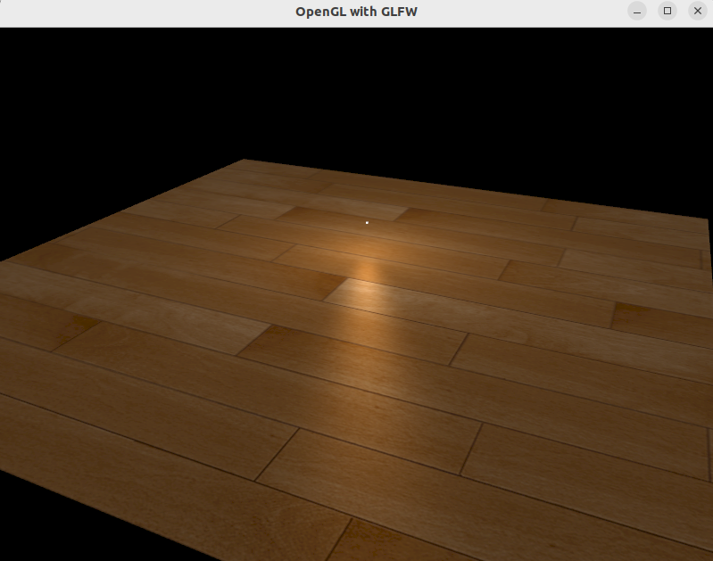

## Exemplo-32 (Camera Depth Mapping)
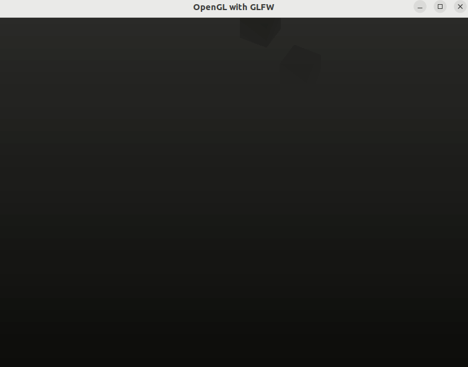

## Exemplo-33 (Directional Shadow Mapping)


## Exemplo-34 (Point Shadow Mapping)


## Exemplo-35 (Normal Mapping)
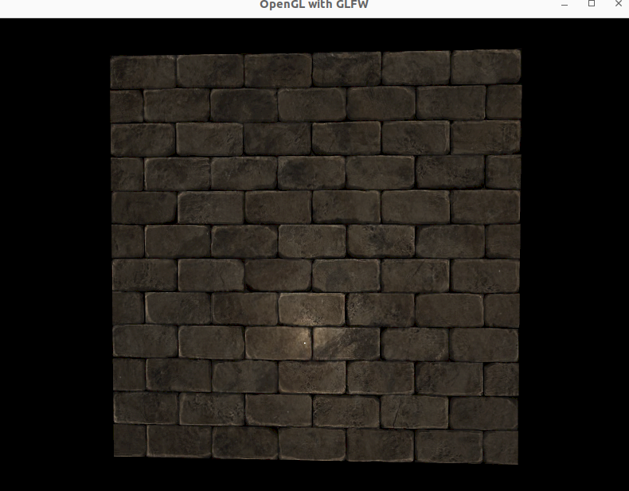

## Exemplo-37 (Model Normal Mapping)
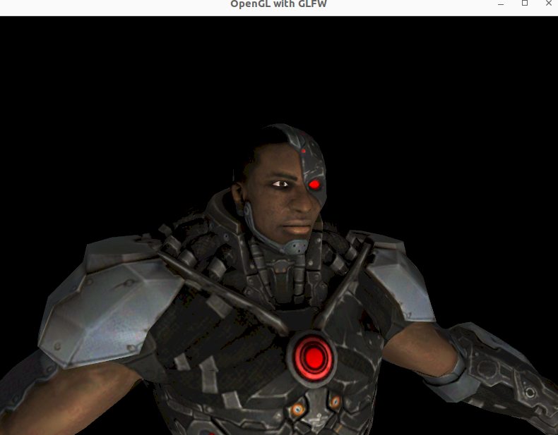

## Exemplo-38 (Render Text)
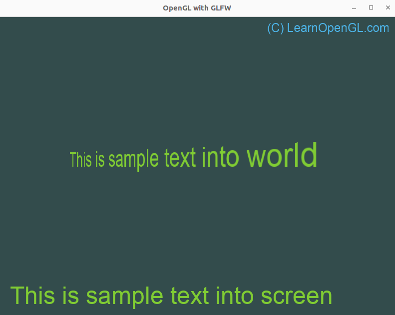

## Exemplo-41 (Parallax Mapping)
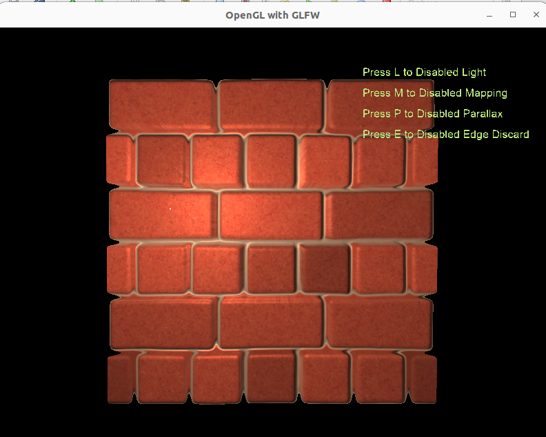

## Exemplo-41 (Parallax Mapping Occlusion)
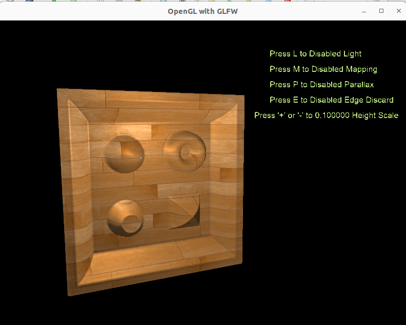
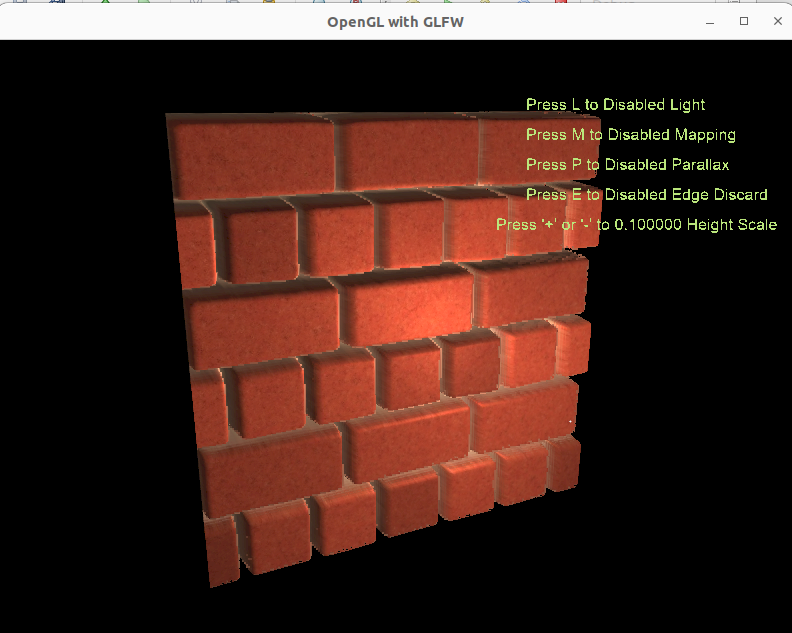

