# learn-modern-opengl

Projeto criado para aprender opengl - exemplos com refatorações do site [learn opengl](https://learnopengl.com/)

## 📋 Instalações das dependências (Linux)

### Instalação da lib X11

```
sudo apt-get install doxygen dnf xorg-dev
sudo dnf install libXcursor-devel libXi-devel libXinerama-devel libXrandr-devel
```

### Instalação da lib GLFW (GLFW-3.3.8):

Baixar o pacote [GLFW-3.3.8](https://www.glfw.org/download)

Após baixar, extrair e faça a compilação usando os comandos dentro da pasta ```glfw-3.3.8```

```
cmake -S . -B build
cmake build
cd build
make build
sudo make install
```

Ao finalizar, será exibido no terminal, os locais de instalações das libs e os includes como pode ser visto na imagem abaixo
ser visto na imagem:

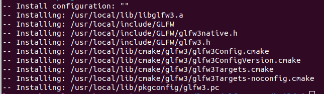

### Instalação do Assimp (Assimp-5.3.1):

Baixe o Assimp [assimp-5.3.1](https://github.com/assimp/assimp)
após baixar, extrair e faça a sua build

```
cd assimp
cmake CMakeLists.txt 
cmake --build .
```

após fazer a build, copie os arquivos ```.so``` para a pasta ```/usr/local/lib``` e crie um atalho do ```libassimp.so.5``` para a 
pasta principal do projeto clonado

## 🔧 Configuração do CodeBlock:

Verifique se a configuração do seu codeblock como segue as imagens a seguir:

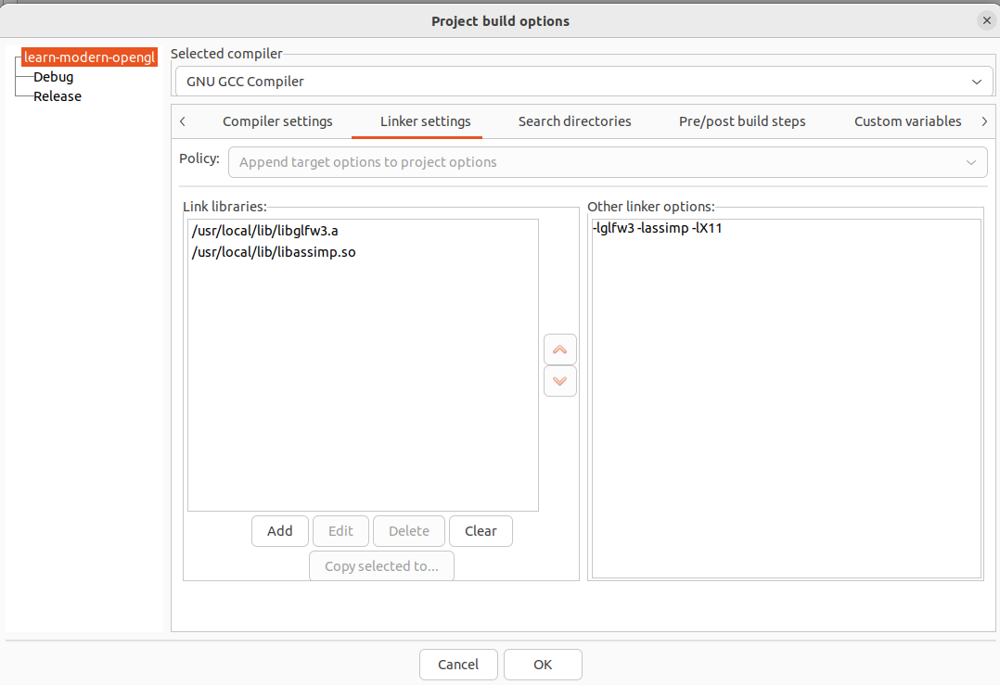
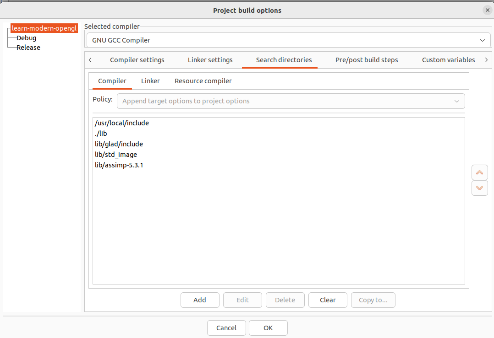
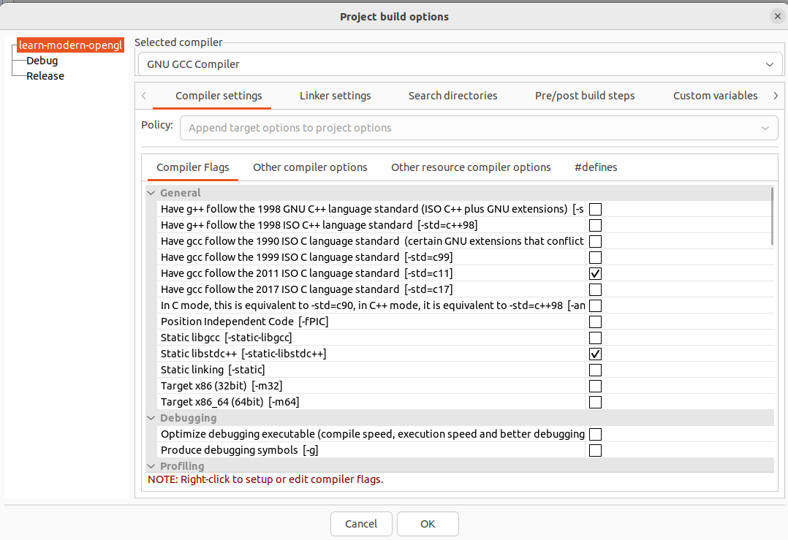


Pronto, o Codeblock está configurado

### 🚀 Executando um exemplo

Após finalizar a instalação das libs e a configuração do codeblock, no arquivo ```main.cpp``` mude os exemplos pela definition ```EXEC_TEST X``` , onde o ```X``` é o número do exemplo que você desejar.

## Exemplo-1
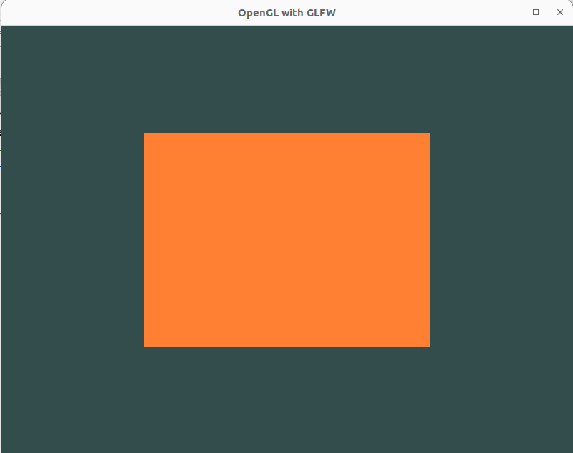

## Exemplo-2
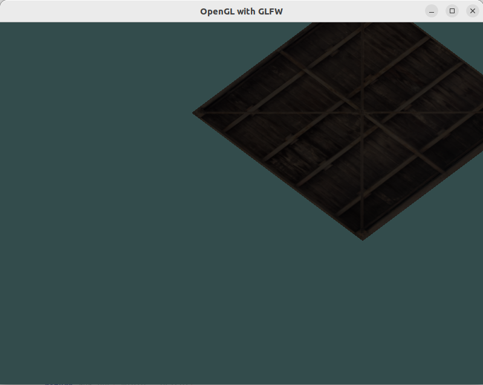

## Exemplo-3
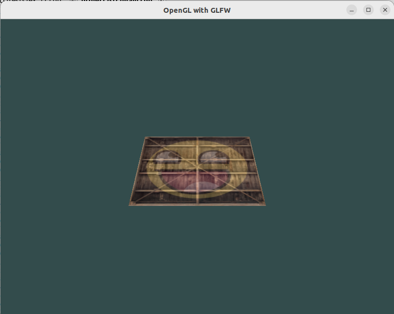

## Exemplo-4


## Exemplo-5
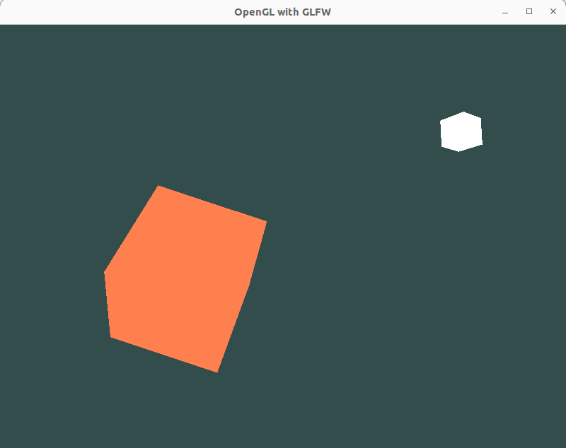

## Exemplo-6
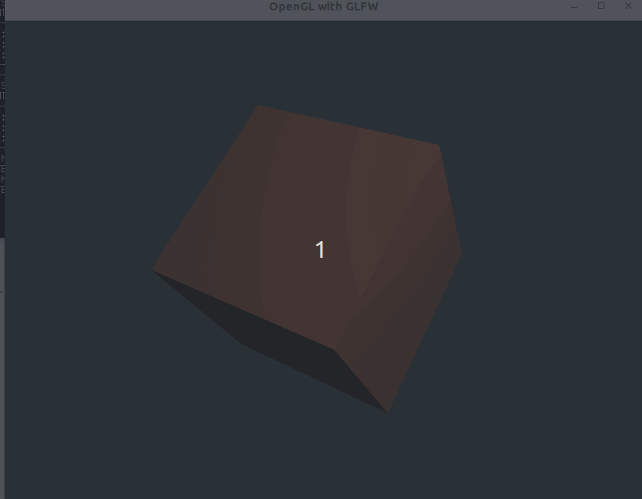

## Exemplo-7
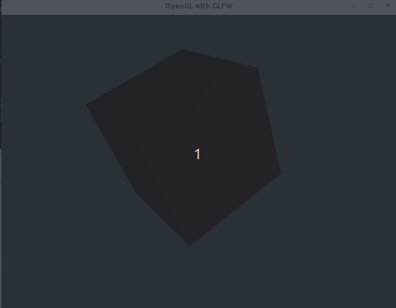

## Exemplo-8


## Exemplo-9
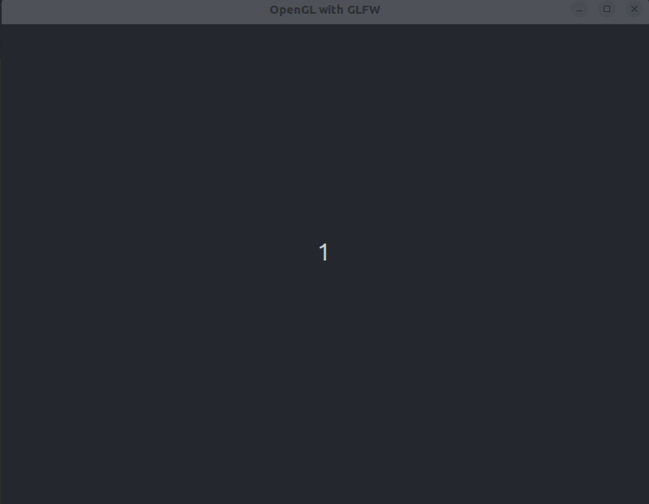

## Exemplo-10
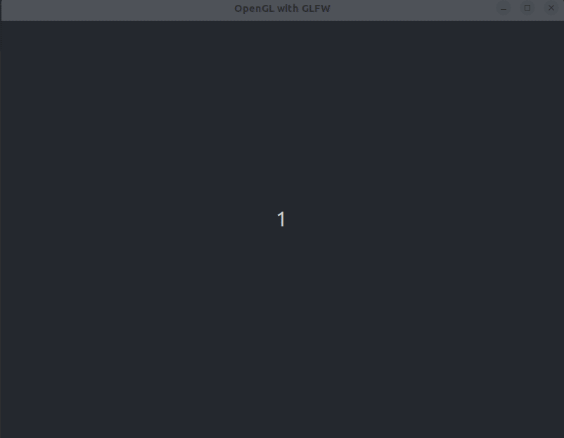

## Exemplo-12
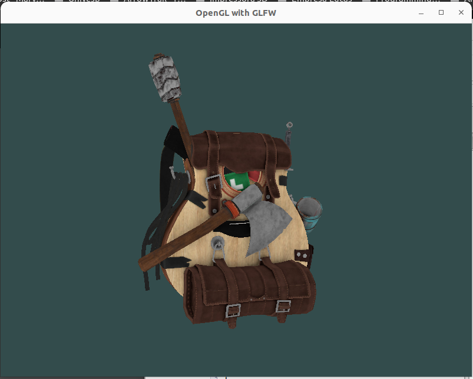

## Exemplo-14
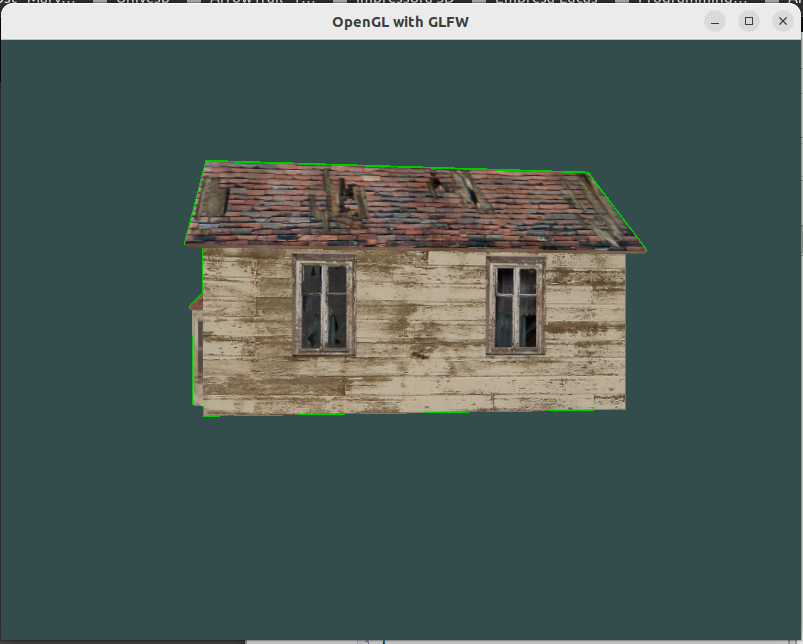

## Exemplo-15
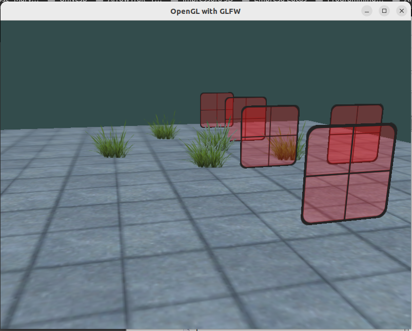

## Exemplo-16
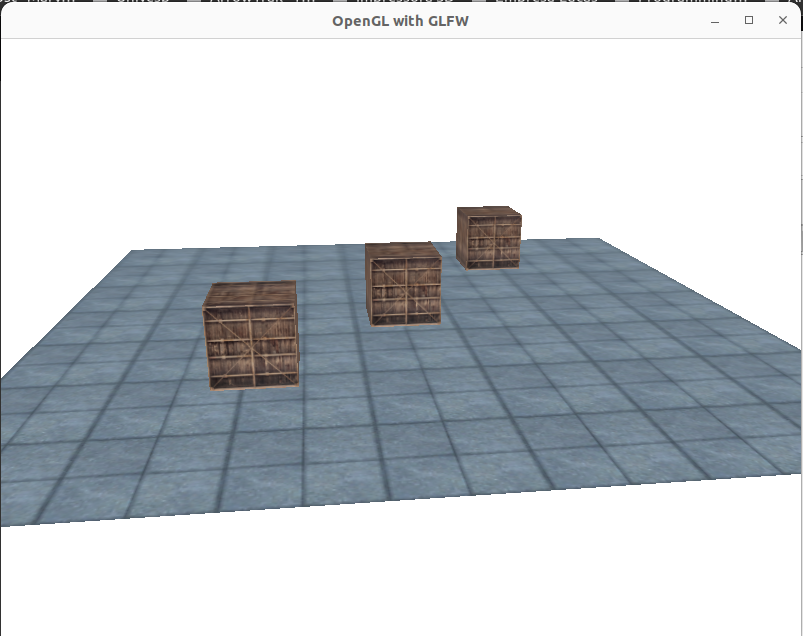

## Exemplo-17
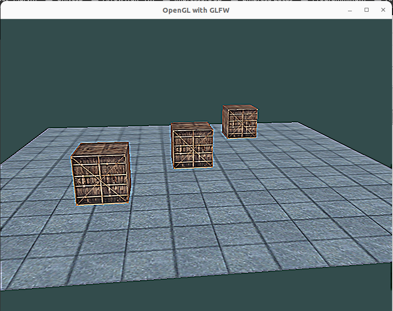
